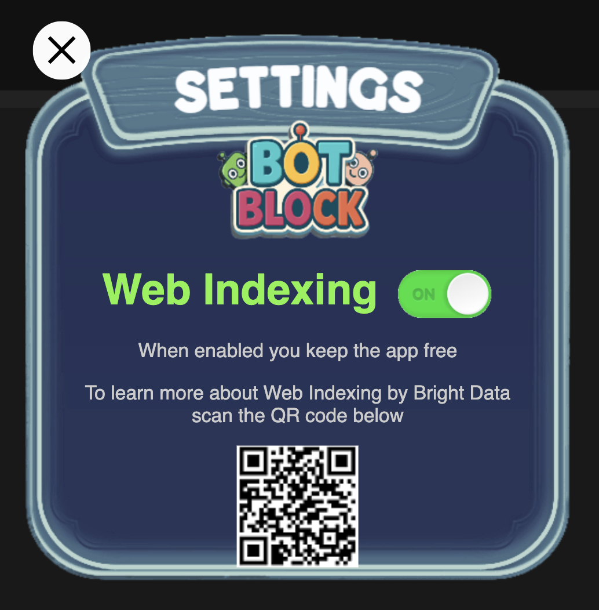

# BrightSDK Settings Dialog



A modular, keyboard-navigable Settings Dialog for BrightSDK-powered apps. Includes Web Indexing toggle, event callbacks, and QR code display.

## ✨ Features

- Modal dialog overlay with Web Indexing toggle
- Customizable QR code support
- Keyboard navigation (UP/DOWN/ENTER/BACK)
- Flash animation to highlight focused elements
- Callbacks for show/hide and checkbox interaction
- Simple integration with BrightSDK apps
- Development environment for local testing

---

## 📦 Installation

Download the dialog latest version from the source repository:

```bash
wget -P dist https://raw.githubusercontent.com/BrightSDK/bright-sdk-settings-dialog/refs/heads/main/releases/latest/settingsdialog.bundle.js
```

Include the built bundle directly your HTML:

```html
<script src="dist/settingsdialog.bundle.js"></script>
```

---

## 🚀 Usage

### 1. Load the Dialog

```html
<script src="dist/settingsdialog.bundle.js"></script>
```

### 2. Initialize & Show Dialog

```js
const dialog = SettingsDialog.create({
  title: 'Settings',
  qrCodeUrl: 'https://api.qrserver.com/v1/create-qr-code/?size=150x150&data=https://privacy.brightdata.com',
  onCheckboxClick: (enabled) => {
    console.log('Web Indexing toggled:', enabled);
  },
  onShow: () => {
    console.log('Dialog shown');
  },
  onHide: () => {
    console.log('Dialog hidden');
  }
});

// Show with checkbox state (true = enabled)
dialog.show(true);
```

### 3. Hide the Dialog

```js
dialog.hide();
```

---

## ⚙️ Development

### Project Structure

- `src/settingsdialog.js`: Main module
- `example/index.html`: Sample HTML file for testing the dialog

### Run Locally

1. **Clone the repository** (if you haven't already)

```bash
git clone git@github.com:BrightSDK/bright-sdk-settings-dialog.git
cd bright-sdk-settings-dialog
```

2. **Install dependencies**

Open a terminal and run:

```bash
npm install
```

3. **Start a bundle watcher**

In the same terminal, run:

```bash
npm run dev
```

4. **Open the example**

Open another terminal and run:

```bash
npm run serve
```

Then open [http://localhost:3000](http://localhost:3000) in your browser to view the sample dialog in action.

5. **Build the project**

To generate the production-ready bundle:

```bash
npm run build
```
## Project Structure

- `src/settingsdialog.js`: Main module
- `example/index.html`: Standalone test page
- `dist/`: Webpack-bundled output

### Local Development Server

```bash
npm install
npm run serve
```

Open browser at `http://localhost:3000/example/index.html`.

### Build Scripts

```bash
npm run build         # Production bundle
npm run build-debug   # Development bundle
npm run dev           # Watch mode for development
```

---

## 📚 API

### `SettingsDialog.create(options)`

| Option            | Type       | Description                               |
|------------------|------------|-------------------------------------------|
| `title`          | `string`   | Dialog title text                         |
| `qrCodeUrl`      | `string`   | URL of QR code to show                    |
| `onCheckboxClick`| `function` | Called with new checkbox state            |
| `onShow`         | `function` | Called when dialog is shown               |
| `onHide`         | `function` | Called when dialog is hidden              |

---

## 🎮 Keyboard Support

- **UP**: Switch focus to "Close" button
- **DOWN**: Switch focus to "Web Indexing" checkbox
- **ENTER**: Trigger focused control
- **BACK**: Close dialog

---

## 🖌️ Style & Animation

- Custom font: [Molisa Delawere](https://fonts.cdnfonts.com/css/games)
- `.flash`: Flash animation to highlight